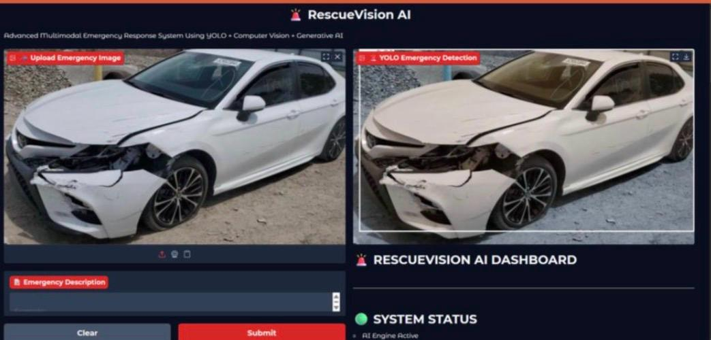
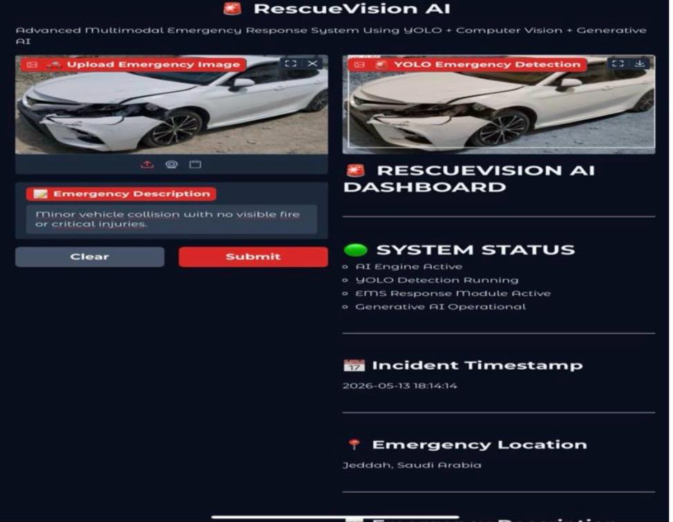
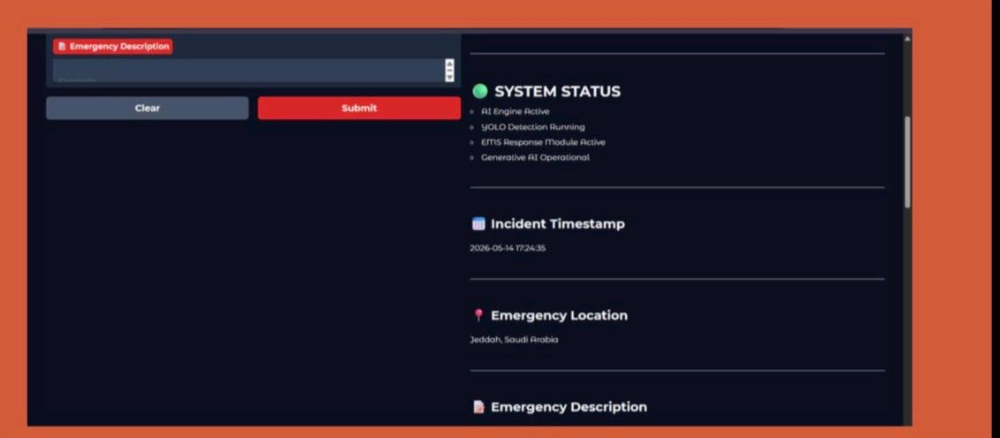
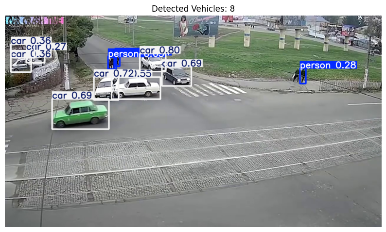

# 🚑 RescueVision AI — Intelligent Emergency Medical Response System

<p align="center">
  <b>An advanced multimodal AI system that detects vehicle accidents, analyzes emergency risk in real time, and automatically generates AI-written emergency response reports.</b>
</p>

<p align="center">
  
  
  
  
  
</p>

---

## 📖 Overview

**RescueVision AI** is an end-to-end intelligent emergency response system built to reduce the critical time gap between a traffic accident occurring and an informed emergency response being dispatched.

The system takes a single accident-scene image as input and automatically:
1. Detects and counts the vehicles involved using **YOLOv8** object detection.
2. Analyzes the severity of the incident and calculates a numeric **risk score**.
3. Generates a full, structured **AI-written emergency report**, including a summary of the incident, first-aid recommendations, and suggested EMS (Emergency Medical Services) response actions.
4. Displays everything on a live, interactive **dashboard**, so a user (dispatcher, first responder, or bystander) can understand the situation and act on it within seconds.

This project combines three AI domains — **Computer Vision (YOLOv8)**, **rule-based risk analysis**, and **Generative AI (text generation)** — into a single practical emergency-response pipeline.

---

## 🎯 Problem Statement

Traditional emergency response relies heavily on manual reporting: a witness or victim must call emergency services, describe what happened, and wait for responders to assess the situation on arrival. This process is slow, inconsistent, and prone to human error — especially when the caller is in shock or unable to communicate clearly.

**RescueVision AI** addresses this gap by allowing an image of the accident scene (e.g., from a dashcam, CCTV, or a bystander's phone) to be instantly analyzed by AI, producing a structured, objective, and immediate assessment that can support human decision-making — not replace it.

---

## ✨ Key Features

- 🚗 **Automated Vehicle Detection** — Uses a pretrained YOLOv8 model (`yolov8n.pt`) to detect and count vehicles (cars, motorcycles, buses, trucks) present in the accident-scene image.
- ⚠️ **Severity & Risk Scoring Engine** — A rule-based analysis module maps the number of detected vehicles and scene context to a severity level: **LOW**, **MODERATE**, or **HIGH**, along with a numeric risk score (1–10).
- 📝 **AI-Generated Emergency Reports** — A Hugging Face `transformers` text-generation pipeline converts the detection results and severity data into a clear, structured report containing:
  - Incident summary
  - First-aid recommendations
  - Suggested EMS response actions
- 📸 **Image Upload & Annotation** — Users upload an accident image; the system returns an annotated version showing bounding boxes around every detected vehicle.
- 🕒 **Incident Metadata Logging** — Automatically records the incident timestamp and emergency location (e.g., city/region) alongside the analysis.
- 📊 **Model Evaluation Suite** — Includes accuracy, precision, recall, F1-score, and a confusion matrix to evaluate the accident-detection component's performance on the test dataset.
- 🌐 **Interactive Web Dashboard** — Built with **Gradio**, unifying image upload, detection, severity analysis, and report generation into a single real-time interface. The dashboard shows:
  - Live **System Status** (AI Engine Active, YOLO Detection Running, EMS Response Module Active, Generative AI Operational)
  - Incident Timestamp
  - Emergency Location
  - Emergency Description (auto-generated + editable)

---

## 🛠️ Tech Stack

| Category | Tools / Libraries |
|---|---|
| Object Detection | Ultralytics **YOLOv8** (`yolov8n.pt`) |
| Computer Vision | **OpenCV** |
| Report Generation (NLP) | Hugging Face **Transformers** (text-generation pipeline) |
| Model Evaluation | **Scikit-learn** (accuracy, precision, recall, F1, confusion matrix) |
| Web Interface | **Gradio** |
| Data Handling & Visualization | **Pandas**, **Matplotlib** |
| Development Environment | Google Colab |

---

## ⚙️ How the System Works (Pipeline)

1. **Dataset Analysis** — The system loads and explores the accident/non-accident image dataset, summarizing the class distribution across train, validation, and test splits to ensure balanced model training.
2. **Vehicle Detection** — When a new accident image is provided, YOLOv8 runs inference on it, detecting every vehicle and drawing bounding boxes with confidence scores.
3. **Severity & Risk Analysis** — A dedicated function takes the number and type of detected vehicles (plus any additional scene signals) and classifies the incident's severity as LOW, MODERATE, or HIGH, alongside a 1–10 risk score.
4. **AI Report Generation** — The severity level, incident type, vehicle count, and risk score are passed into a text-generation model, which produces a coherent, human-readable emergency report: what likely happened, recommended first-aid steps, and what EMS actions are advised.
5. **Dashboard Assembly** — All outputs (annotated image, system status, timestamp, location, description, and generated report) are displayed together on the Gradio dashboard in real time.

---

## 🖼️ Demo

<p align="center">
  
  
</p>

<p align="center">
  
  
</p>

**What you're seeing:**
- **Left images:** The RescueVision AI dashboard — an uploaded accident image (a damaged Toyota Camry) next to the YOLO-annotated detection result, with the live system status panel (AI Engine Active, YOLO Detection Running, EMS Response Module Active, Generative AI Operational), incident timestamp, and emergency location (Jeddah, Saudi Arabia).
- **Right image:** A separate detection test on a busy street/intersection scene, where the model successfully detected **8 vehicles and pedestrians** with individual confidence scores.

---

## 📊 Model Evaluation

The vehicle/accident detection component was evaluated using standard classification metrics:
- **Accuracy**
- **Precision**
- **Recall**
- **F1-score**
- **Confusion Matrix**

These metrics confirm the reliability of the detection stage before its output is passed into the severity-analysis and report-generation stages.

---

## 🚀 Installation & Usage

### 1. Clone the repository
```bash
git clone https://github.com/ghadaalsulami-coder/rescuevision-ai-emergency-response.git
cd rescuevision-ai-emergency-response
```

### 2. Install dependencies
```bash
pip install -r requirements.txt
```

### 3. Run the notebook
Open `RescueVision AI.ipynb` in Jupyter Notebook or Google Colab and run all cells in order. This will:
- Load the YOLOv8 model
- Launch the Gradio dashboard

### 4. Use the dashboard
1. Upload an accident-scene image.
2. (Optional) Add or edit the Emergency Description.
3. Click **Submit**.
4. View the annotated detection result, severity/risk analysis, and the AI-generated emergency report on the dashboard.

---


## 📂 Project Structure

| File | Description |
|---|---|
| `RescueVision AI.ipynb` | Main notebook — detection, analysis, report generation, dashboard |
| `requirements.txt` | Project dependencies |
| `dashboard_full_view.png` | Demo image — full dashboard view |
| `yolo_detection_result.png` | Demo image — YOLO detection result |
| `dashboard_status.png` | Demo image — system status panel |
| `vehicle_detection_demo.png` | Demo image — multi-vehicle detection test |
| `README.md` | Project documentation |

---

## ⚠️ Disclaimer

This project is an **academic / research prototype** developed for learning and demonstration purposes. It is **not a certified emergency-response tool** and should never replace official emergency services (e.g., calling 911/997) or professional medical judgment. Always contact licensed emergency responders in a real emergency.

---

## 🔮 Future Improvements

- Integrate real-time video stream analysis (not just static images).
- Add multi-language support for the generated reports.
- Connect directly to a live EMS dispatch API for real-world deployment.
- Expand severity analysis with additional visual signals (e.g., fire, smoke, visible injuries) using a dedicated classification model.

---


## 👩‍💻 Author

**Ghada Alsulami**
📌 Email: gabdullh84@gmail.com
---

## 📜 License

This project is licensed under the **MIT License** — you are free to use, modify, and distribute it with proper attribution.

---

<p align="center">💡 Built with a passion for using AI to make emergency response faster, smarter, and more effective.</p>
